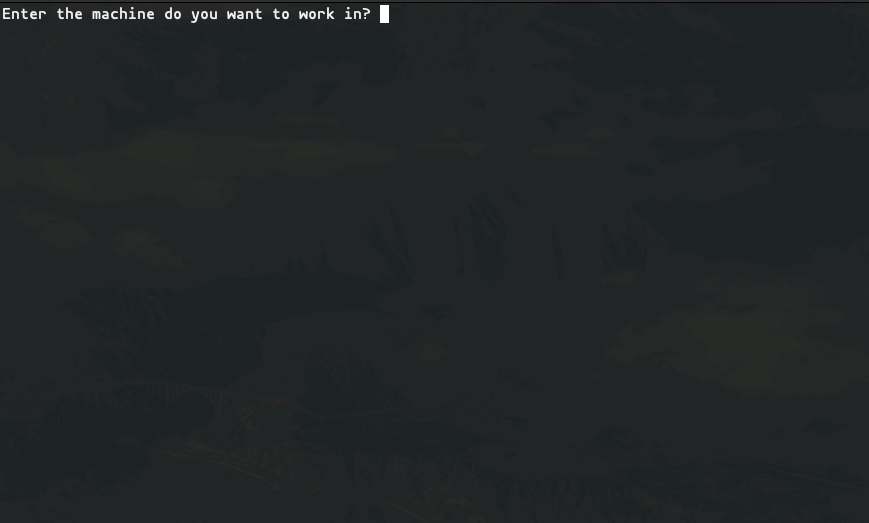

## Exploding Dots

If you have never experienced exploding dots, stop reading this and go there now: [explodingdots.org](https://www.explodingdots.org). Seriously, go explore the first two Islands and then come back. I'll wait... OK, now that you are back, exploding dots is a great way of exploring ~~arithmetic~~ mathematics in different bases. The connection between elementary school long division, and polynomial division explored in [Lesson 6.2 of Exploding Dots](https://www.explodingdots.org/station/I6S13) blows me away every time. 

Why not build exploding dots machines using python! Essentially, exploding dots is repeated division while keeping track of the remainders. Computers are fantastic at this kind of thing. We can recreate any integer machine with about 20 lines of code. This makes it a great coding activity for beginners. Bonus question: this script only works for n ∈ ℕ such that n > 1. When using a 1 ← 1 machine, the script never prints an output. What is going on here?

- [Sample program in colab](exploding_dots.ipynb)

Here is the code in action.

James Tanton has a ton of other great resources to check out.
- [G'day Math](https://gdaymath.com)
- [Thinking Mathematics](http://www.jamestanton.com)
- [Problem-Solving Strategies](https://www.maa.org/math-competitions/teachers/curriculum-inspirations)
