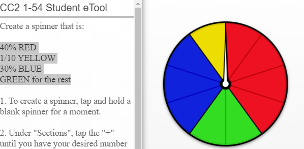

# Experimental Probability

Students construct a probability spinned using an online tool. We used [CPM etools](https://technology.cpm.org/general/probability/) but something like mathigon's polypad will also work. The constraints for the spinner were that 40% had to be red, one tenth yellow, 30% blue, and the rest green.

We spent some time talking about the theoretical probablitity of each color and expressed each probability as a fraction, a decimal, and a precent. Then students started collecting Experimental data. Collectively we did 115 spins, while tracking the frequency of each color. Finally we wrote a little python program that charted each color and then calculated the experimental probability of each color.

- [sample program in replit](https://replit.com/@MrHelmstedter/spinnerdata#main.py)
