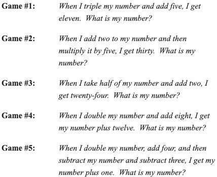
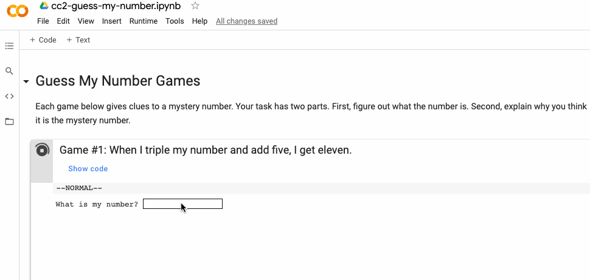

# Guess My Number Games

This is a little gem from [CPM](https://www.cpm.org). It starts with a simple premise, students are given a set of arithmetic directions and students have to figure out the mystery number. For example, if I triple my number and add 4 I get 19. Students can use whatever algorithm makes sense to them as they figure it out. Here are some more examples.



The beauty of this activity is the formal algebra has been stripped away (momentarily) leaving space for students to make sense of and reason out the relationships on their own. Typically, I start these as a whole class. No one is allowed to speak out loud. After some independent work time (generally mental math) we do a little countdown and shout out the answer all together. It makes for a great introduction to solving equations in math 7 and is even better in math 8 when we talk about number of solutions to an equation. We'll build some confidence with the entire class shouting out the same number, and then watch the ensuing chaos when they realize some have multiple solutions, and some have no solution.

While I will probably do that again this year, I will also include a coding component. Below is a simple program that represents the game "When I triple my number and add five, I get eleven." In less than 10 lines of code we can create an interactive game that builds conceptual understanding of solving equations.

```python
while True:
    num = int(input("What is my number? "))
    result = 11
    steps = 3*(num) + 5
    if steps == result:
        print('Noice!')
        break
    else: 
        print("That's not my number. Try again."
```

Here it is in action in a google colab notebook.


